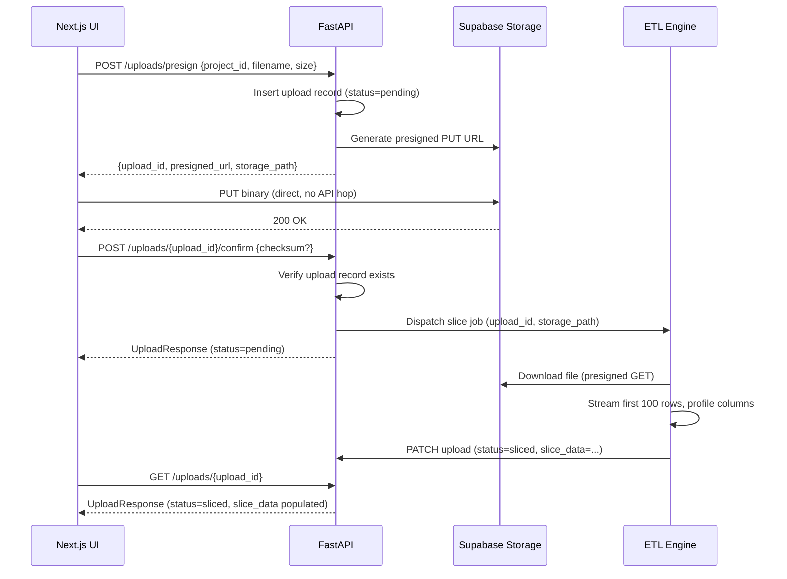
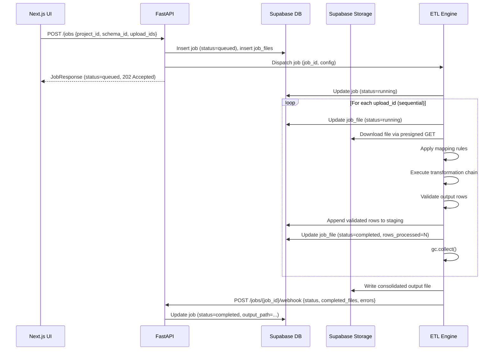
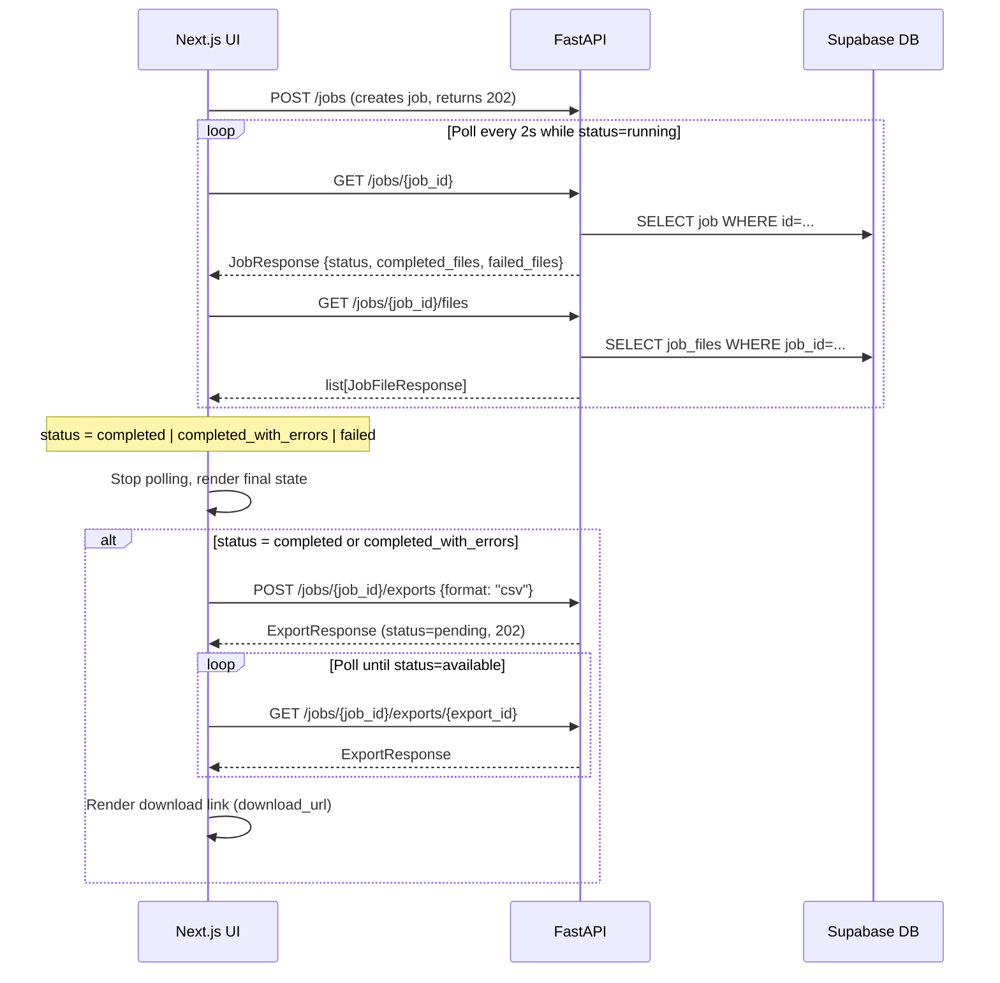

# SchemaFlow API Specification

Version: `v1`  
Base URL: `https://<host>/api/v1`  
Authentication: `Authorization: Bearer <supabase_jwt>`

All responses are `application/json`. All timestamps are ISO 8601 UTC. All IDs are UUIDs.

---

## Authentication

SchemaFlow uses Supabase Auth. Clients obtain a JWT by authenticating directly with Supabase Auth (email/password or OAuth). The JWT is then passed to every FastAPI endpoint in the `Authorization: Bearer` header.

The FastAPI `get_current_user` dependency validates the JWT signature using the Supabase `jwt_secret` and extracts `user_id` and `email`. Service functions receive `user_id: UUID` — never the raw token.

**Token expiry:** Supabase JWTs expire after 1 hour. Clients must use Supabase's `refreshSession()` to obtain a new token before expiry.

---

## Error Model

All error responses share a single schema:

```json
{
  "error": "Human-readable error category",
  "details": [
    { "field": "body.name", "message": "Field required" }
  ],
  "request_id": "optional-trace-id"
}
```

| HTTP Status | When |
|---|---|
| 400 | Invalid request semantics (business rule violation) |
| 401 | Missing or expired JWT |
| 403 | Authenticated but not authorized for this resource |
| 404 | Resource not found or not owned by the requesting user |
| 422 | Pydantic validation failure (field-level errors in `details`) |
| 500 | Unhandled server error (details suppressed; logged server-side) |

---

## Cursor Pagination

All list endpoints use cursor-based pagination.

**Query params:** `cursor` (opaque string, from previous `next_cursor`) · `limit` (integer, default 20, max 100)

**Response shape:**
```json
{
  "items": [...],
  "next_cursor": "eyJpZCI6Ii4uLiJ9"
}
```
`next_cursor` is `null` when no further pages exist.

---

## Projects

### `GET /projects`
List projects for the authenticated user.

**Query:** `cursor?` `limit?`  
**Response 200:** `ProjectListResponse`

### `POST /projects`
Create a new project.

**Request:**
```json
{
  "name": "Q3 Consolidation",
  "description": "Optional description"
}
```
**Validation:** `name` 1–100 chars · `description` max 500 chars  
**Response 201:** `ProjectResponse`

### `GET /projects/{project_id}`
**Response 200:** `ProjectResponse` · **404** if not found or not owned

### `PATCH /projects/{project_id}`
Partial update. All fields optional.

**Request:**
```json
{
  "name": "Updated Name",
  "description": "Updated description",
  "status": "archived"
}
```
**Validation:** `status` must be `active` or `archived`  
**Response 200:** `ProjectResponse`

### `DELETE /projects/{project_id}`
**Response 204** · **404** if not found

---

**ProjectResponse:**
```json
{
  "id": "uuid",
  "user_id": "uuid",
  "name": "Q3 Consolidation",
  "description": null,
  "status": "active",
  "created_at": "2026-07-02T10:00:00Z",
  "updated_at": "2026-07-02T10:00:00Z"
}
```

---

## Uploads

### `GET /uploads`
List uploads for a project.

**Query:** `project_id` (required) · `cursor?` `limit?`  
**Response 200:** `UploadListResponse`

### `POST /uploads/presign`
Generate a presigned PUT URL for direct Supabase Storage upload.

**Request:**
```json
{
  "project_id": "uuid",
  "original_filename": "report_north.xlsx",
  "size": 204800,
  "mime_type": "application/vnd.openxmlformats-officedocument.spreadsheetml.sheet"
}
```
**Validation:** `size` 1–31,457,280 bytes (30 MB max)  
**Response 201:** `PresignResponse`
```json
{
  "upload_id": "uuid",
  "presigned_url": "https://storage.supabase.co/...",
  "storage_path": "uploads/{user_id}/{project_id}/{upload_id}.xlsx",
  "expires_in": 300
}
```

### `POST /uploads/{upload_id}/confirm`
Call after the binary has been PUT to Supabase Storage. Triggers async structural slice extraction.

**Request:**
```json
{
  "checksum": "optional-sha256-hex"
}
```
**Response 200:** `UploadResponse` (status: `pending`, slice populates asynchronously)

### `GET /uploads/{upload_id}`
**Response 200:** `UploadResponse`

---

**UploadResponse:**
```json
{
  "id": "uuid",
  "project_id": "uuid",
  "user_id": "uuid",
  "original_filename": "report_north.xlsx",
  "filename": "uuid.xlsx",
  "file_extension": "xlsx",
  "size_bytes": 204800,
  "status": "sliced",
  "slice_data": {
    "version": 1,
    "worksheet": "Sheet1",
    "header_row_index": 0,
    "columns": [
      {
        "name": "record_date",
        "inferred_type": "date",
        "null_rate": 0.0,
        "sample_values": ["2024-01-15", "2024-01-16"],
        "cardinality_estimate": 98
      }
    ],
    "rows": [{"record_date": "2024-01-15"}]
  },
  "created_at": "2026-07-02T10:00:00Z",
  "updated_at": "2026-07-02T10:01:00Z"
}
```

**Upload status values:** `pending` → `sliced` | `error`

---

## Schemas

### `GET /schemas`
**Query:** `project_id` (required) · `cursor?` `limit?`  
**Response 200:** `SchemaListResponse`

### `POST /schemas`
**Request:**
```json
{
  "project_id": "uuid",
  "name": "Standard Output v1",
  "description": null,
  "columns": [
    {
      "name": "entry_date",
      "display_name": "Entry Date",
      "type": "date",
      "nullable": false,
      "date_format": "YYYY-MM-DD",
      "validation_rules": [
        { "type": "required", "params": {} }
      ]
    },
    {
      "name": "amount",
      "display_name": "Amount",
      "type": "float",
      "nullable": true,
      "date_format": null,
      "validation_rules": [
        { "type": "range", "params": { "min": 0, "max": 9999999 } }
      ]
    }
  ]
}
```
**Validation:** At least one column required · `type` must be `string|integer|float|date|boolean` · `date_format` required when `type=date`  
**Response 201:** `SchemaResponse`

### `GET /schemas/{schema_id}`
**Response 200:** `SchemaResponse`

### `PATCH /schemas/{schema_id}`
Replaces the full column list if `columns` is provided. Partial column updates are not supported.

**Response 200:** `SchemaResponse`

### `DELETE /schemas/{schema_id}`
**Response 204** · Returns **409** if a job references this schema (ON DELETE RESTRICT)

---

## Mappings

### `GET /mappings/{upload_id}`
**Query:** `schema_id` (required)  
**Response 200:** `MappingResponse`

### `PUT /mappings/{upload_id}`
Replace the mapping for this upload/schema pair. Upserts — creates if not exists.

**Request:**
```json
{
  "upload_id": "uuid",
  "schema_id": "uuid",
  "entries": [
    { "source_col": "record_date", "dest_col": "entry_date", "user_confirmed": true },
    { "source_col": "region", "dest_col": null, "user_confirmed": true }
  ]
}
```
**Response 200:** `MappingResponse`

### `POST /mappings/auto`
Returns scored suggestions without persisting. The client reviews suggestions and submits confirmed entries via `PUT /mappings/{upload_id}`.

**Request:**
```json
{
  "upload_id": "uuid",
  "schema_id": "uuid",
  "threshold": 60
}
```
**Response 200:** `AutoMapResponse`
```json
{
  "upload_id": "uuid",
  "schema_id": "uuid",
  "suggestions": [
    { "source_col": "record_date", "dest_col": "entry_date", "confidence": 88 },
    { "source_col": "region", "dest_col": "region_code", "confidence": 74 }
  ],
  "unmatched_sources": ["legacy_id"],
  "unmatched_destinations": ["amount"]
}
```

---

## Transformations

### `GET /transformations/registry`
Returns all transformation types in the ETL registry with their parameter schemas.

**Response 200:**
```json
{
  "entries": [
    {
      "type": "trim",
      "description": "Remove leading and trailing whitespace.",
      "params_schema": {}
    },
    {
      "type": "date_format",
      "description": "Reformat a date string from one format to another.",
      "params_schema": {
        "from_format": { "type": "string", "required": true },
        "to_format": { "type": "string", "required": true }
      }
    },
    {
      "type": "cast",
      "description": "Cast value to a target primitive type.",
      "params_schema": {
        "target_type": { "type": "string", "enum": ["string", "integer", "float", "boolean"], "required": true }
      }
    },
    {
      "type": "fill_null",
      "description": "Replace null values with a default.",
      "params_schema": { "value": { "required": true } }
    },
    {
      "type": "regex_extract",
      "description": "Extract a capture group from a string using a regex pattern.",
      "params_schema": {
        "pattern": { "type": "string", "required": true },
        "group": { "type": "integer", "default": 1 }
      }
    }
  ]
}
```

### `GET /transformations/{schema_id}`
List all transformation rule sets for a schema (one per destination column).  
**Response 200:** `TransformationListResponse`

### `GET /transformations/{schema_id}/{dest_column}`
**Response 200:** `TransformationResponse`

### `PUT /transformations/{schema_id}/{dest_column}`
Replace the full rule chain for a destination column. Empty `rules` array clears all rules.

**Request:**
```json
{
  "rules": [
    {
      "id": "11111111-1111-1111-1111-111111111111",
      "type": "trim",
      "params": {},
      "order": 0
    },
    {
      "id": "22222222-2222-2222-2222-222222222222",
      "type": "date_format",
      "params": { "from_format": "MM/DD/YYYY", "to_format": "YYYY-MM-DD" },
      "order": 1
    }
  ]
}
```
**Response 200:** `TransformationResponse`

---

## Jobs

### `POST /jobs`
Create and enqueue an ETL consolidation job. Returns immediately with `status: queued`.

**Request:**
```json
{
  "project_id": "uuid",
  "schema_id": "uuid",
  "upload_ids": ["uuid-1", "uuid-2"]
}
```
**Validation:** All `upload_ids` must belong to `project_id` and have status `sliced`  
**Response 202:** `JobResponse`

### `GET /jobs`
**Query:** `project_id` (required) · `cursor?` `limit?`  
**Response 200:** `JobListResponse`

### `GET /jobs/{job_id}`
**Response 200:** `JobResponse`

### `GET /jobs/{job_id}/files`
Per-file status within the batch job.  
**Response 200:** `list[JobFileResponse]`

---

**JobResponse:**
```json
{
  "id": "uuid",
  "project_id": "uuid",
  "user_id": "uuid",
  "schema_id": "uuid",
  "status": "completed_with_errors",
  "total_files": 3,
  "completed_files": 2,
  "failed_files": 1,
  "errors": {
    "files": [
      {
        "upload_id": "uuid",
        "filename": "report_west.xlsx",
        "stage": "validate_stage",
        "message": "Column 'amount' contains non-numeric values at row 47",
        "row_index": 47
      }
    ]
  },
  "started_at": "2026-07-02T10:05:00Z",
  "completed_at": "2026-07-02T10:07:30Z",
  "created_at": "2026-07-02T10:04:58Z",
  "updated_at": "2026-07-02T10:07:30Z"
}
```

**Job status values:** `queued` → `running` → `completed` | `completed_with_errors` | `failed`

---

## Exports

### `POST /jobs/{job_id}/exports`
Generate an export file from a completed job. Returns immediately with `status: pending`.

**Request:**
```json
{ "job_id": "uuid", "format": "csv" }
```
**Validation:** `format` must be `csv` or `xlsx` · Job must be `completed` or `completed_with_errors`  
**Response 202:** `ExportResponse`

### `GET /jobs/{job_id}/exports/{export_id}`
**Response 200:** `ExportResponse`

---

**ExportResponse:**
```json
{
  "id": "uuid",
  "job_id": "uuid",
  "user_id": "uuid",
  "format": "csv",
  "size_bytes": 45312,
  "row_count": 982,
  "status": "available",
  "download_url": "https://storage.supabase.co/...",
  "expires_at": "2026-07-09T10:07:30Z",
  "created_at": "2026-07-02T10:07:30Z",
  "updated_at": "2026-07-02T10:07:45Z"
}
```

**Export status values:** `pending` → `available` | `expired` | `error`  
`download_url` is a short-lived presigned GET URL. `null` when status is not `available`.

---

## Internal Endpoints

### `POST /jobs/{job_id}/webhook`
Called by the ETL runner on job completion or failure. Not accessible by frontend clients.

**Auth:** `X-Internal-Secret: <shared-secret>` header (validated against env var `INTERNAL_WEBHOOK_SECRET`)  
**Request:**
```json
{
  "status": "completed",
  "completed_files": 3,
  "failed_files": 0,
  "errors": null,
  "started_at": "2026-07-02T10:05:00Z",
  "completed_at": "2026-07-02T10:07:30Z"
}
```
**Response 204**

---

## Sequence Diagrams

### Upload Flow



### ETL Job Flow



### Progress Monitoring Flow



---

## Job Lifecycle State Machine

```
queued
  │
  ▼
running
  │
  ├──(all files succeeded)──────────────► completed
  │
  ├──(some files succeeded, some failed)──► completed_with_errors
  │
  └──(total failure / ETL crash)──────────► failed
```

---

## Background Job Lifecycle

1. **`POST /jobs`** — FastAPI inserts the job row (`status=queued`) and one `job_files` row per upload. Returns `202 Accepted` immediately.
2. **Dispatch** — FastAPI calls `dispatch_etl_job(job_id, config)`. The strategy (subprocess / celery / http) is configured via `ETL_RUNNER` env var.
3. **ETL start** — The ETL engine updates the job to `status=running` and begins sequential file processing.
4. **Per-file loop** — Each file is downloaded from Storage, mapped, transformed, validated, and written to a staging buffer. `gc.collect()` is called between files. Errors are captured per-file and do not abort the remaining batch.
5. **Completion** — On loop exit, the ETL consolidates staging data into the final output file, uploads it to Storage, and calls `POST /jobs/{job_id}/webhook` with the final status.
6. **Webhook handler** — FastAPI updates the job row (`status`, `completed_files`, `failed_files`, `errors`, `output_path`) and marks `completed_at`.
7. **Export** — The client calls `POST /jobs/{job_id}/exports` to generate a presigned download URL in the requested format.

---

## Endpoint Index

| Method | Path | Description | Auth |
|---|---|---|---|
| GET | /projects | List projects | User JWT |
| POST | /projects | Create project | User JWT |
| GET | /projects/{id} | Get project | User JWT |
| PATCH | /projects/{id} | Update project | User JWT |
| DELETE | /projects/{id} | Delete project | User JWT |
| GET | /uploads | List uploads | User JWT |
| POST | /uploads/presign | Get presigned upload URL | User JWT |
| POST | /uploads/{id}/confirm | Confirm upload, trigger slice | User JWT |
| GET | /uploads/{id} | Get upload + slice data | User JWT |
| GET | /schemas | List schemas | User JWT |
| POST | /schemas | Create schema | User JWT |
| GET | /schemas/{id} | Get schema | User JWT |
| PATCH | /schemas/{id} | Update schema | User JWT |
| DELETE | /schemas/{id} | Delete schema | User JWT |
| GET | /mappings/{upload_id} | Get mapping | User JWT |
| PUT | /mappings/{upload_id} | Save mapping | User JWT |
| POST | /mappings/auto | Get auto-map suggestions | User JWT |
| GET | /transformations/registry | List transformation types | User JWT |
| GET | /transformations/{schema_id} | List all rules for schema | User JWT |
| GET | /transformations/{schema_id}/{col} | Get column rule chain | User JWT |
| PUT | /transformations/{schema_id}/{col} | Save column rule chain | User JWT |
| POST | /jobs | Create and enqueue job | User JWT |
| GET | /jobs | List jobs | User JWT |
| GET | /jobs/{id} | Get job status | User JWT |
| GET | /jobs/{id}/files | Get per-file status | User JWT |
| POST | /jobs/{id}/exports | Request export | User JWT |
| GET | /jobs/{id}/exports/{export_id} | Get export + download URL | User JWT |
| POST | /jobs/{id}/webhook | ETL completion callback | Internal secret |
