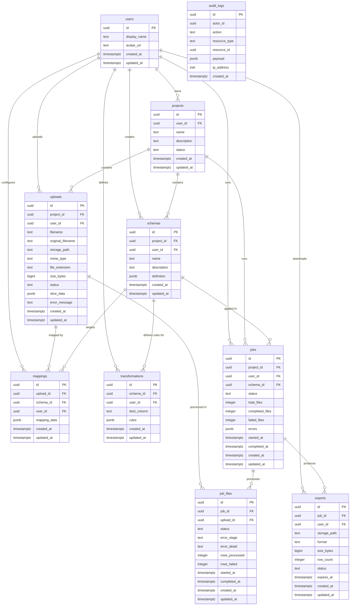

# Database Architecture — SchemaFlow

## 1. Entity Relationship Diagram



---

## 2. Table Reference

### `users`
Extends Supabase Auth's `auth.users` with application-level profile data. The `id` is a direct foreign key to `auth.users(id)` — no separate sequence. Cascade delete ensures that removing an auth user removes all their data.

### `projects`
Top-level organizational unit. A project groups all uploads, schemas, and jobs for a single consolidation task. The `status` column (`active` | `archived`) enables soft deactivation without data loss. Archived projects remain queryable for history but cannot accept new uploads or jobs.

### `uploads`
One row per spreadsheet file. Binary content lives in Supabase Storage; this table holds only references (`storage_path`), metadata (`size_bytes`, `file_extension`, `mime_type`), and the structural slice result (`slice_data` JSONB).

**Status lifecycle:**
```
pending → confirmed → sliced → (ready for mapping)
                   → error   (slice extraction failed)
```

`original_filename` preserves the user-supplied name independently of the internal `filename` used for Storage (which uses the upload UUID to avoid collisions).

### `schemas`
Destination schema definitions. The `definition` JSONB column holds the complete column specification including types, nullable flags, date formats, and validation rules. Multiple schemas can exist per project, enabling different output formats from the same input files.

### `mappings`
Source-to-destination column mapping for one upload against one schema. The `UNIQUE(upload_id, schema_id)` constraint enforces that a given file is mapped to a given schema exactly once. Confidence scores and user-confirmation state live inside `mapping_data` JSONB — they are not queried in WHERE clauses so JSONB is appropriate.

### `transformations`
Ordered transformation rule chain for a single destination column. The `UNIQUE(schema_id, dest_column)` constraint ensures one rule set per column per schema. Rules are pure configuration — the ETL registry executes them by name at job time. Transformations are defined at the schema level (not per-upload), making them reusable across all uploads in a project.

### `jobs`
ETL job execution record. Created synchronously (status=`queued`), processed asynchronously by the ETL engine. `total_files`, `completed_files`, and `failed_files` are typed INTEGER columns (not JSONB) because they are queried frequently for progress display and the job list dashboard. `ON DELETE RESTRICT` on `project_id` and `schema_id` prevents deleting a project or schema while a job references it — jobs must be deleted first.

**Status lifecycle:**
```
queued → running → completed
                → completed_with_errors
                → failed
```

### `job_files`
Per-file processing record within a batch. Decouples file-level status and error detail from the aggregate job record. `error_stage` identifies which pipeline stage failed (`ingest`, `profile`, `map`, `transform`, `validate`, `export`), enabling targeted debugging without parsing free-text. `UNIQUE(job_id, upload_id)` prevents duplicate processing entries.

### `exports`
Output file record produced by a completed job. Separated from `jobs` because:
- A job can produce multiple export formats (CSV + XLSX simultaneously in future).
- Export lifecycle (availability, expiry, deletion) is independent of job lifecycle.
- Download tracking belongs to the export record, not the job.

`expires_at` defaults to 7 days from creation. Application-level cleanup marks records as `expired` and removes objects from Storage. The partial index on `expires_at WHERE status = 'available'` keeps expiry scans fast.

### `audit_logs`
Immutable, append-only activity log. Never updated or deleted from the application layer. `actor_id` is a soft reference (no FK constraint) — logs are retained even after a user account is deleted. RLS allows users to read only their own audit entries; writes go through the service role only.

---

## 3. Keys, Indexes, and Relationships

### Primary Keys
All tables use `UUID` primary keys generated with `gen_random_uuid()`. UUIDs are collision-safe across distributed inserts and do not leak record counts.

### Foreign Keys and ON DELETE Behavior

| Table | FK Column | References | ON DELETE |
|---|---|---|---|
| users | id | auth.users(id) | CASCADE |
| projects | user_id | users(id) | CASCADE |
| uploads | project_id | projects(id) | CASCADE |
| uploads | user_id | users(id) | (default RESTRICT) |
| schemas | project_id | projects(id) | CASCADE |
| schemas | user_id | users(id) | (default RESTRICT) |
| mappings | upload_id | uploads(id) | CASCADE |
| mappings | schema_id | schemas(id) | CASCADE |
| mappings | user_id | users(id) | (default RESTRICT) |
| transformations | schema_id | schemas(id) | CASCADE |
| transformations | user_id | users(id) | (default RESTRICT) |
| jobs | project_id | projects(id) | **RESTRICT** |
| jobs | schema_id | schemas(id) | **RESTRICT** |
| jobs | user_id | users(id) | (default RESTRICT) |
| job_files | job_id | jobs(id) | CASCADE |
| job_files | upload_id | uploads(id) | **RESTRICT** |
| exports | job_id | jobs(id) | CASCADE |
| exports | user_id | users(id) | (default RESTRICT) |

`RESTRICT` on `jobs.project_id` and `jobs.schema_id` protects historical job records. A project or schema cannot be deleted while jobs reference it — the user must delete jobs first or archive the project.

### Unique Constraints

| Table | Constraint | Purpose |
|---|---|---|
| mappings | (upload_id, schema_id) | One mapping per upload per schema |
| transformations | (schema_id, dest_column) | One rule set per column per schema |
| job_files | (job_id, upload_id) | One processing record per file per job |

### Index Strategy

| Index | Table | Columns | Type | Rationale |
|---|---|---|---|---|
| projects_user_id_idx | projects | user_id | Standard | Project list by user |
| projects_status_idx | projects | (user_id, status) | Composite | Active/archived filter |
| uploads_project_id_idx | uploads | project_id | Standard | Uploads per project |
| uploads_user_id_idx | uploads | user_id | Standard | User ownership checks |
| uploads_status_idx | uploads | (project_id, status) | Composite | Ready-to-map filter |
| schemas_project_id_idx | schemas | project_id | Standard | Schemas per project |
| mappings_upload_id_idx | mappings | upload_id | Standard | Mapping lookup by upload |
| mappings_schema_id_idx | mappings | schema_id | Standard | Mappings per schema |
| transformations_schema_id_idx | transformations | schema_id | Standard | Rules per schema |
| jobs_user_id_idx | jobs | user_id | Standard | Job list by user |
| jobs_project_id_idx | jobs | project_id | Standard | Jobs per project |
| jobs_schema_id_idx | jobs | schema_id | Standard | Jobs per schema |
| jobs_active_idx | jobs | (user_id, created_at DESC) | **Partial** (queued/running only) | Dashboard active jobs |
| jobs_status_idx | jobs | status | **Partial** (queued/running only) | ETL dispatcher polling |
| job_files_job_id_idx | job_files | job_id | Standard | Files per job |
| job_files_upload_id_idx | job_files | upload_id | Standard | Job history per upload |
| job_files_active_idx | job_files | (job_id, status) | **Partial** (pending/running only) | Progress tracking |
| exports_job_id_idx | exports | job_id | Standard | Exports per job |
| exports_user_id_idx | exports | user_id | Standard | User export history |
| exports_expiry_idx | exports | expires_at | **Partial** (available only) | Expiry cleanup scans |
| audit_logs_resource_idx | audit_logs | (resource_type, resource_id, created_at DESC) | Composite | Activity per resource |
| audit_logs_actor_idx | audit_logs | (actor_id, created_at DESC) | Composite | Activity per user |

---

## 4. JSONB Column Specifications

### `uploads.slice_data`

```typescript
type SliceData = {
  version: number;                   // bump on incompatible shape change
  worksheet: string;                 // worksheet name parsed
  header_row_index: number;          // 0-indexed detected header row
  columns: {
    name: string;
    inferred_type: "string" | "integer" | "float" | "date" | "boolean";
    null_rate: number;               // 0.0–1.0
    sample_values: unknown[];        // up to 5 non-null values
    cardinality_estimate: number | null;
  }[];
  rows: Record<string, unknown>[];   // max 100 rows — structural sample only
};
```

**Design note:** `rows` is capped at 100 by the ETL profiler. The UI hard limit of 100 rows enforces this at the rendering layer. Full data is never stored in PostgreSQL.

### `schemas.definition`

```typescript
type SchemaDefinition = {
  version: number;
  columns: {
    name: string;                    // unique within schema; used as output column name
    display_name?: string;
    type: "string" | "integer" | "float" | "date" | "boolean";
    nullable: boolean;
    date_format?: string;            // e.g. "YYYY-MM-DD"; only when type = "date"
    validation_rules?: {
      type: "required" | "regex_match" | "range" | "allowed_values" | "type_check";
      params: Record<string, unknown>;
    }[];
  }[];
};
```

### `mappings.mapping_data`

```typescript
type MappingData = {
  version: number;
  entries: {
    source_col: string;
    dest_col: string | null;         // null = explicitly unmapped
    confidence: number;              // 0–100; from RapidFuzz token_sort_ratio
    user_confirmed: boolean;
  }[];
};
```

### `transformations.rules`

```typescript
type TransformationRuleSet = {
  version: number;
  rules: {
    id: string;                      // client UUID; stable across drag-to-reorder
    type: string;                    // ETL registry key (e.g. "trim", "cast")
    params: Record<string, unknown>;
    order: number;                   // matches array index; kept for UI stability
  }[];
};
```

### `jobs.errors`

```typescript
type JobErrors = {
  files: {
    upload_id: string;
    filename: string;
    stage: string;                   // "ingest" | "profile" | "map" | "transform" | "validate" | "export"
    message: string;
    row_index?: number;              // absent for stage-level errors
  }[];
};
```

### `audit_logs.payload`

```typescript
type AuditPayload = {
  before?: Record<string, unknown>;  // state before the action
  after?: Record<string, unknown>;   // state after the action
  metadata?: Record<string, unknown>; // additional event context
};
```

---

## 5. Row-Level Security Summary

All tables have RLS enabled. Default posture: deny all. Policies explicitly grant access.

| Table | Policy | Rule |
|---|---|---|
| users | Self read/write | `auth.uid() = id` |
| projects | User isolation | `auth.uid() = user_id` |
| uploads | User isolation | `auth.uid() = user_id` |
| schemas | User isolation | `auth.uid() = user_id` |
| mappings | User isolation | `auth.uid() = user_id` |
| transformations | User isolation | `auth.uid() = user_id` |
| jobs | User isolation | `auth.uid() = user_id` |
| job_files | Join-based | Job's `user_id = auth.uid()` |
| exports | User isolation | `auth.uid() = user_id` |
| audit_logs | Read own only | `auth.uid() = actor_id` (SELECT only) |

**Service role** (FastAPI backend, ETL callbacks) bypasses RLS. The service role key is never exposed to the frontend. All writes to `audit_logs` use the service role.

---

## 6. Migration Strategy

### Principles

1. **Additive only in production.** New columns are added as `NULLABLE` with no default. Existing rows are unaffected.
2. **Never rename or drop** without a multi-phase plan: add new column → migrate data → deprecate old column → remove (three separate migrations, three separate deployments).
3. **JSONB version field.** Every top-level JSONB object includes a `version` integer. Breaking shape changes increment the version; application code handles both versions during the transition window.
4. **Migration file naming:** `YYYYMMDDHHMMSS_descriptive_name.sql`
5. **Each migration is self-contained** — includes table DDL, indexes, RLS, and triggers.
6. **Every migration includes a rollback comment** at the top.

### Adding a Column (example)

```sql
-- Migration: 20241015000000_add_uploads_checksum.sql
-- Adds file integrity checksum to uploads.
-- Rollback: ALTER TABLE uploads DROP COLUMN IF EXISTS checksum;

ALTER TABLE uploads ADD COLUMN checksum TEXT;

COMMENT ON COLUMN uploads.checksum IS 'SHA-256 hex digest of the uploaded file binary';
```

### Evolving a JSONB Shape (example)

JSONB shape changes are handled in application code, not DDL:

```python
# In upload_service.py — read both v1 and v2 slice_data
def parse_slice_data(raw: dict) -> SliceData:
    version = raw.get("version", 1)
    if version == 1:
        return _parse_v1(raw)
    if version == 2:
        return _parse_v2(raw)
    raise ValueError(f"Unknown slice_data version: {version}")
```

### Adding a New Status Value

Status columns use `CHECK` constraints, not enum types, to allow additive changes:

```sql
-- Migration: 20241020000000_add_upload_status_processing.sql
-- Rollback: ALTER TABLE uploads DROP CONSTRAINT uploads_status_check;
--           ALTER TABLE uploads ADD CONSTRAINT uploads_status_check
--             CHECK (status IN ('pending', 'confirmed', 'sliced', 'error'));

ALTER TABLE uploads DROP CONSTRAINT uploads_status_check;
ALTER TABLE uploads ADD CONSTRAINT uploads_status_check
  CHECK (status IN ('pending', 'confirmed', 'sliced', 'processing', 'error'));
```

---

## 7. Sample Records

The following records represent a complete flow: project creation → upload → schema definition → column mapping → transformation rules → job execution → export.

**Project**
```json
{
  "id": "00000000-0000-0000-0000-000000000010",
  "user_id": "00000000-0000-0000-0000-000000000001",
  "name": "Q3 Consolidation",
  "description": "Consolidating regional reports for Q3 analysis",
  "status": "active"
}
```

**Upload** (after slice extraction)
```json
{
  "id": "00000000-0000-0000-0000-000000000020",
  "project_id": "00000000-0000-0000-0000-000000000010",
  "filename": "00000000-0000-0000-0000-000000000020.xlsx",
  "original_filename": "region_north.xlsx",
  "storage_path": "uploads/.../{upload_id}.xlsx",
  "file_extension": "xlsx",
  "size_bytes": 204800,
  "status": "sliced",
  "slice_data": {
    "version": 1,
    "worksheet": "Sheet1",
    "header_row_index": 0,
    "columns": [
      { "name": "record_date", "inferred_type": "date", "null_rate": 0.0, "sample_values": ["2024-01-15"], "cardinality_estimate": 98 },
      { "name": "region", "inferred_type": "string", "null_rate": 0.02, "sample_values": ["North"], "cardinality_estimate": 4 },
      { "name": "value", "inferred_type": "float", "null_rate": 0.05, "sample_values": [1250.50], "cardinality_estimate": null }
    ],
    "rows": []
  }
}
```

**Schema**
```json
{
  "id": "00000000-0000-0000-0000-000000000030",
  "name": "Standard Output v1",
  "definition": {
    "version": 1,
    "columns": [
      { "name": "entry_date", "type": "date", "nullable": false, "date_format": "YYYY-MM-DD", "validation_rules": [{ "type": "required", "params": {} }] },
      { "name": "region_code", "type": "string", "nullable": false, "validation_rules": [{ "type": "allowed_values", "params": { "values": ["North","South","East","West"] } }] },
      { "name": "amount", "type": "float", "nullable": true, "validation_rules": [{ "type": "range", "params": { "min": 0, "max": 9999999 } }] }
    ]
  }
}
```

**Mapping**
```json
{
  "mapping_data": {
    "version": 1,
    "entries": [
      { "source_col": "record_date", "dest_col": "entry_date", "confidence": 88, "user_confirmed": true },
      { "source_col": "region", "dest_col": "region_code", "confidence": 74, "user_confirmed": true },
      { "source_col": "value", "dest_col": "amount", "confidence": 62, "user_confirmed": true }
    ]
  }
}
```

**Transformation (entry_date column)**
```json
{
  "dest_column": "entry_date",
  "rules": {
    "version": 1,
    "rules": [
      { "id": "uuid", "type": "date_format", "params": { "from_format": "MM/DD/YYYY", "to_format": "YYYY-MM-DD" }, "order": 0 }
    ]
  }
}
```

**Job (completed)**
```json
{
  "status": "completed",
  "total_files": 1,
  "completed_files": 1,
  "failed_files": 0,
  "errors": null,
  "started_at": "2024-07-02T10:00:00Z",
  "completed_at": "2024-07-02T10:02:30Z"
}
```

**Export**
```json
{
  "storage_path": "exports/.../{job_id}.csv",
  "format": "csv",
  "size_bytes": 45312,
  "row_count": 982,
  "status": "available",
  "expires_at": "2024-07-09T10:02:30Z"
}
```

**Audit Log entries**
```json
[
  { "action": "project.created", "resource_type": "project", "payload": { "after": { "name": "Q3 Consolidation" } } },
  { "action": "upload.sliced",   "resource_type": "upload",  "payload": { "after": { "status": "sliced", "columns": 3 } } },
  { "action": "job.started",     "resource_type": "job",     "payload": { "after": { "status": "running" } } },
  { "action": "job.completed",   "resource_type": "job",     "payload": { "after": { "status": "completed", "total_files": 1 } } },
  { "action": "export.created",  "resource_type": "export",  "payload": { "after": { "format": "csv", "row_count": 982 } } }
]
```

---

## 8. Design Rationale and Tradeoffs

### Why JSONB for schemas, mappings, and transformations?

These structures are user-defined and variable. A destination schema with 5 columns and one with 50 columns must coexist without DDL changes. Storing them as JSONB avoids the `ALTER TABLE` anti-pattern and keeps the relational structure stable regardless of how many user-defined schemas exist.

The `version` field inside each JSONB object provides a migration path when the shape needs to evolve incompatibly — both old and new versions can be read simultaneously during a transition window.

### Why are jobs.total_files / completed_files / failed_files typed columns?

These three values are displayed in the dashboard job list and progress bar on every page load. Extracting them from JSONB on every query would require either a generated column or a slow `->` operator scan. Typed columns make the query trivially fast and allow future indexing if needed.

### Why a separate exports table instead of output_path on jobs?

`output_path` on `jobs` was sufficient for Phase 2's scope. Phase 3 separates exports because:

- A job will eventually support multiple output formats simultaneously (CSV + XLSX).
- Export expiry, download tracking, and status transitions are independent of job lifecycle.
- Keeping exports separate avoids widening the already-busy `jobs` row on every download event.

### Why ON DELETE RESTRICT on jobs.project_id and jobs.schema_id?

Jobs are historical records. Silently losing job history when a project is deleted is a worse outcome than preventing the delete. The constraint forces an explicit decision: the user must delete or transfer jobs before deleting a project. This is intentional friction that prevents accidental data loss.

### Why is audit_logs.actor_id a soft reference?

A hard FK would prevent deletion of a user account as long as audit records exist. Since audit logs must be retained for compliance and history, the FK is intentionally omitted. Deleted users become anonymous actors in the log — their `actor_id` remains but has no corresponding `users` row.

### What was intentionally not designed?

- **Project sharing / multi-user collaboration** — not in scope. All ownership is single-user (`user_id` on every table). A `project_members` table would be the natural extension point when needed.
- **Schema versioning history** — the `definition` JSONB `version` field tracks breaking changes, but previous definitions are not archived. A `schema_history` table would be the extension point.
- **Real-time subscriptions** — the schema supports Supabase Realtime on `jobs` and `job_files` without modification (no special columns needed). This is a deployment configuration, not a schema concern.

---

## 9. Architecture Summary

The database serves four distinct concerns through a single, stable relational schema:

| Concern | Tables | Mechanism |
|---|---|---|
| **File management** | uploads | Storage paths + JSONB slice metadata |
| **Schema configuration** | schemas, mappings, transformations | Versioned JSONB — metadata-driven, domain-agnostic |
| **Job execution** | jobs, job_files | Typed status columns + JSONB error detail |
| **Output management** | exports | Independent lifecycle from jobs |
| **Observability** | audit_logs | Append-only, soft-reference actor |

The schema is intentionally stable. Business meaning lives entirely in JSONB configuration objects — the relational tables never change shape when a user defines a new kind of data. This is the core property that makes SchemaFlow domain-agnostic: the database has no concept of employees, invoices, or any other business entity. It knows only projects, uploads, schemas, and jobs.
